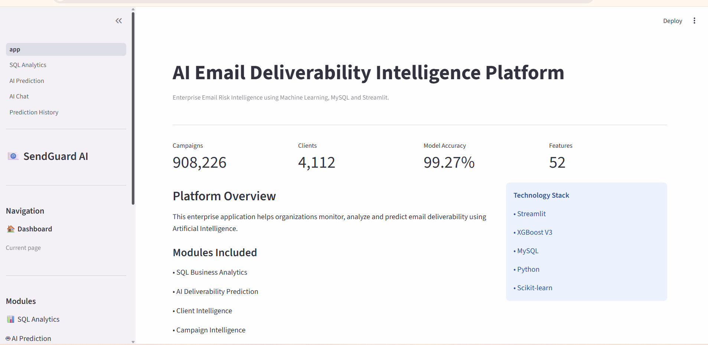
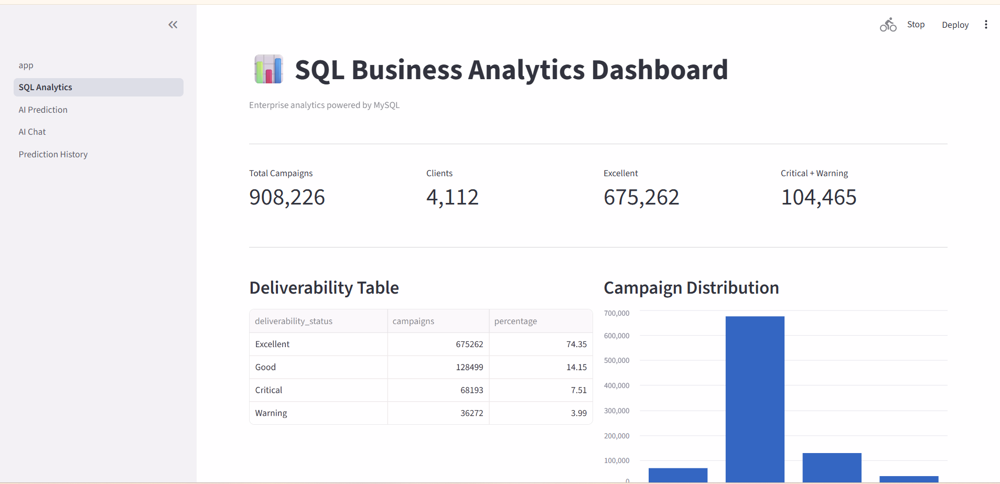
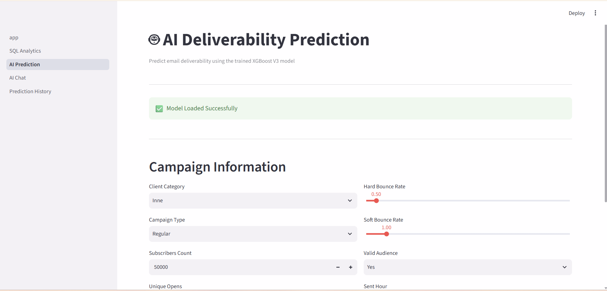
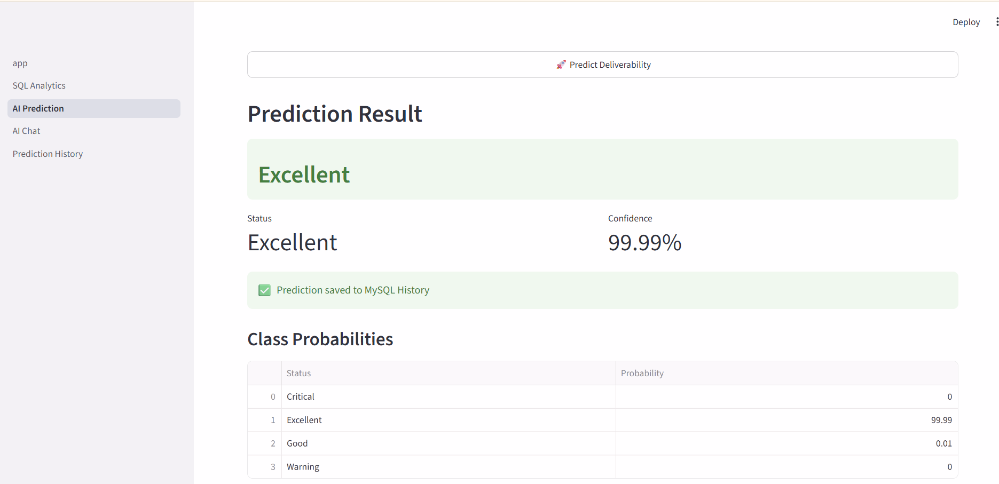
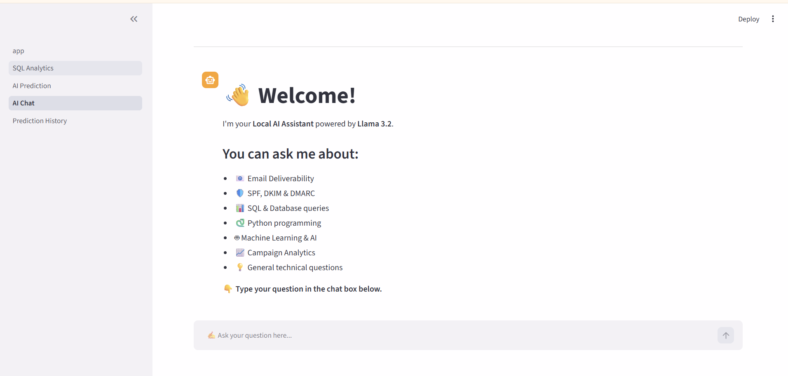
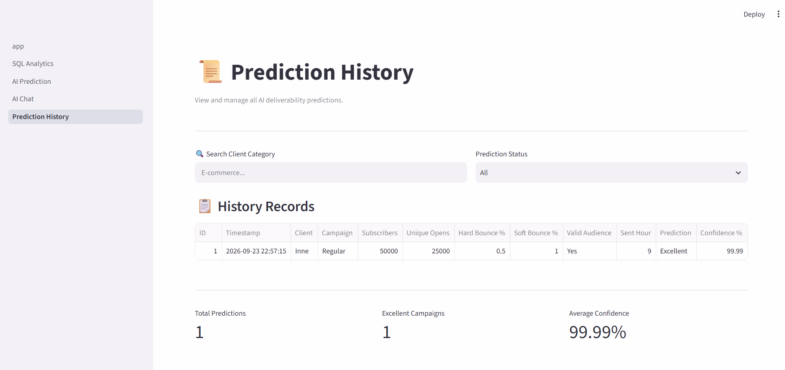

# 🚀 AI Email Deliverability Intelligence Platform

An end-to-end AI-powered email analytics platform that predicts email deliverability using **XGBoost**, provides **SQL analytics**, stores prediction history in **MySQL**, and includes an **offline AI assistant powered by Llama 3.2 (Ollama)**.

---

## 📌 Project Overview

Email deliverability determines whether marketing emails reach the inbox or spam folder. This platform helps marketers and analysts evaluate campaign quality before sending emails by combining Machine Learning, SQL Analytics, MySQL, and Generative AI into one interactive application.

### Business Objectives

- Predict email deliverability before campaign launch
- Analyze campaign performance using SQL
- Maintain historical prediction records
- Answer technical questions using an offline AI assistant
- Improve sender reputation through data-driven decisions

---

# ✨ Features

### 🤖 AI Deliverability Prediction

- XGBoost multi-class classification
- Predicts 4 deliverability statuses
- Confidence score & probability distribution
- Interactive Streamlit interface

### 📊 SQL Analytics Dashboard

- Client performance
- Open rate analysis
- Bounce rate metrics
- Complaint analysis
- Business KPI dashboard

### 📜 Prediction History

- Stores every prediction in MySQL
- Search by client category
- Filter by prediction status
- Export history as CSV
- Clear prediction history

### 💬 AI Chat Assistant (Offline)

Powered by **Llama 3.2 + Ollama**

Supports questions about:

- Email Deliverability
- SPF / DKIM / DMARC
- SQL
- Python
- Machine Learning
- Campaign Analytics
- General technical concepts

No internet or OpenAI credits required.

---

# 🏗️ System Architecture

```text
                 Email Campaign Dataset
                          │
                          ▼
                Feature Engineering
                          │
                          ▼
          Preprocessing (Ordinal Encoder)
                          │
                          ▼
            XGBoost Classification Model
                          │
          ┌───────────────┼────────────────┐
          │               │                │
          ▼               ▼                ▼
   AI Prediction    SQL Analytics    AI Chat (Llama 3.2)
          │
          ▼
 Prediction History (MySQL)
```

---

# 🧠 Machine Learning Workflow

1. Data Acquisition
2. Data Profiling
3. Feature Engineering
4. Data Cleaning
5. Ordinal Encoding
6. XGBoost Model Training
7. Model Evaluation
8. Streamlit Deployment
9. Prediction Storage in MySQL

---

# 🛠️ Technologies Used

| Category | Technology |
|----------|------------|
| Programming | Python |
| Machine Learning | XGBoost, Scikit-learn |
| Data Processing | Pandas, NumPy |
| Visualization | Plotly |
| Web Framework | Streamlit |
| Database | MySQL |
| Local LLM | Ollama + Llama 3.2 |
| Model Storage | Joblib |
| IDE | VS Code, Jupyter Notebook |

---

# 📂 Project Structure

```text
AI_Email_Deliverability_Intelligence/

├── app.py
├── README.md
├── requirements.txt
│
├── assets/
│   └── screenshots/
│
├── data/
│   └── processed/
│
├── models/
│   ├── xgboost_model_v3.pkl
│   ├── preprocessor_v3.pkl
│   ├── label_encoder_v3.pkl
│   └── schema_v3.pkl
│
├── notebooks/
├── pages/
├── reports/
└── utils/
```

---

# 📊 Deliverability Classes

| Status | Description |
|---------|-------------|
| 🟢 Excellent | Very high inbox placement |
| 🔵 Good | Good deliverability |
| 🟡 Warning | Moderate delivery risk |
| 🔴 Critical | High spam / failure risk |

---

# 📷 Application Screenshots

## 🏠 Home Page



---

## 📊 SQL Analytics Dashboard

Interactive SQL dashboard with KPIs, client analytics, open rate analysis, bounce metrics, and complaint insights.



---

## 🤖 AI Deliverability Prediction

Users enter campaign details including client category, campaign type, subscribers, bounce rates, audience quality, and sending hour.



---

## ✅ Prediction Result

The model predicts deliverability status with confidence score and probability distribution.



---

## 💬 Offline AI Chat Assistant

Powered locally by **Llama 3.2**, capable of answering technical and email deliverability questions without API costs.



---

## 📜 Prediction History

Every prediction is stored inside **MySQL** with search, filtering, CSV export, and history management.



---

# 🗄️ Database Design

Prediction history is automatically stored in MySQL.

| Column | Description |
|---------|-------------|
| ID | Auto Increment Primary Key |
| Timestamp | Prediction Time |
| Client Category | Business Category |
| Campaign Type | Promotional / Newsletter |
| Subscribers | Total Audience |
| Unique Opens | Open Count |
| Hard Bounce Rate | Hard Bounce % |
| Soft Bounce Rate | Soft Bounce % |
| Valid Audience | Yes / No |
| Sent Hour | Campaign Sending Hour |
| Prediction | Deliverability Status |
| Confidence | Model Confidence |

---

# 📈 SQL Analytics Module

The SQL dashboard provides business intelligence through MySQL queries.

### Included Analytics

- Total Clients
- Total Campaigns
- Average Open Rate
- Hard Bounce Analysis
- Soft Bounce Trends
- Complaint Metrics
- Client Performance Ranking

This demonstrates practical SQL skills beyond machine learning.

---

# 💻 Prediction History Module

Features include:

- Search by client category
- Filter by prediction status
- Automatic MySQL storage
- CSV download
- Clear history (Auto resets ID)
- Business KPI summary

---

# 🚀 Installation

### Clone Repository

```bash
git clone https://github.com/saiprasad00700/AI_Email_Deliverability_Intelligence.git

cd AI_Email_Deliverability_Intelligence
```

### Install Dependencies

```bash
pip install -r requirements.txt
```

### Configure MySQL

```sql
CREATE DATABASE email_deliverability_db;
```

Update MySQL credentials inside:

```text
utils/db.py
```

### Install Ollama

```bash
ollama pull llama3.2:3b
```

### Run Application

```bash
streamlit run app.py
```

---

# 🌍 Real World Impact

This platform helps organizations improve email marketing performance by:

- Reducing spam placement
- Improving sender reputation
- Monitoring campaign quality
- Preserving historical predictions
- Supporting data-driven campaign decisions

---

# 🔮 Future Enhancements

- User Authentication
- SHAP Explainable AI
- Campaign Recommendation Engine
- PDF Report Generation
- Email Optimization Suggestions
- Multi-language AI Assistant

---

# 👨‍💻 Author

**Saiprasad Nukala**

**Skills:** Python • SQL • Machine Learning • XGBoost • Streamlit • MySQL • Generative AI • Ollama

GitHub: **saiprasad00700**

---

⭐ If you found this project useful, consider giving it a Star.
